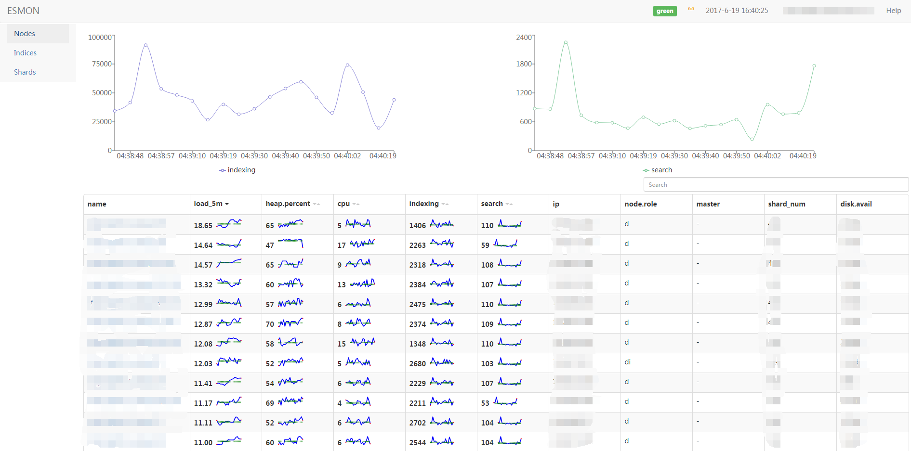

# Elasticsearch Monitoring Dashboard

## getting started

```bash
ES_SERVER_ADDR=http://127.0.0.1:9200 PORT=18080 bin/www
```

## building

```bash
cd client
npm install
npm run build
cp build/static/js/main*.js ../public/javascripts/main.js
cp build/static/css/main*.css ../public/stylesheets/main.css
cd ../
ES_SERVER_ADDR=http://127.0.0.1:9200 PORT=18080 bin/www
```

## setting devel environment

```bash
# install json-server
npm install json-server
```

## screenshots



